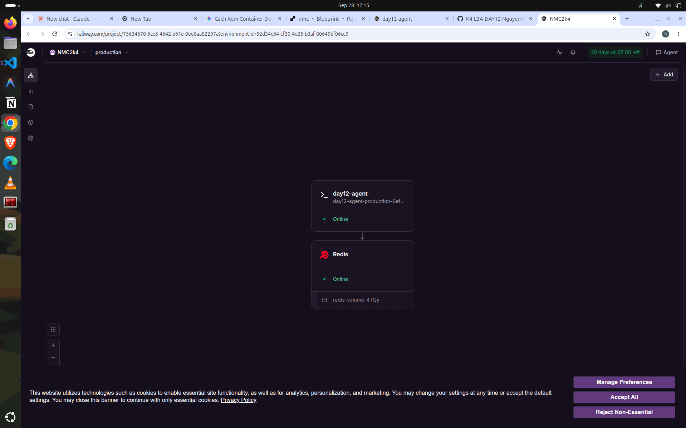
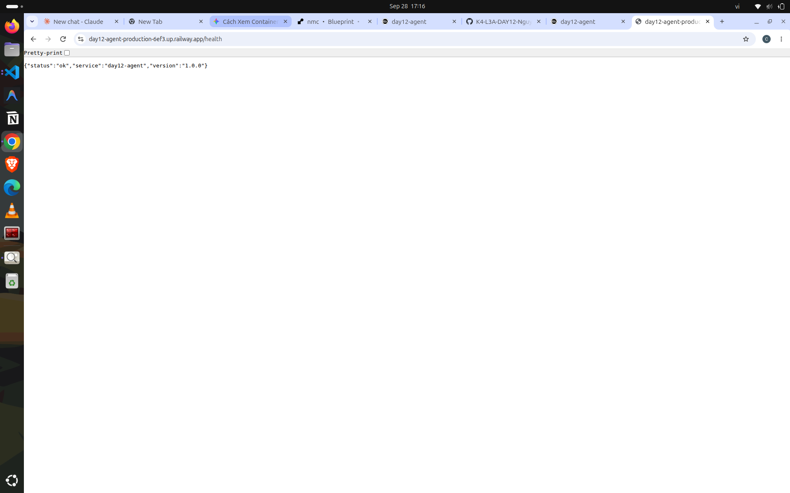
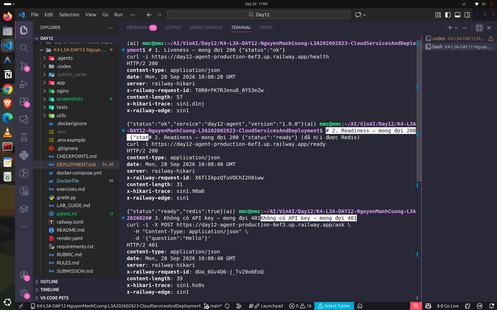
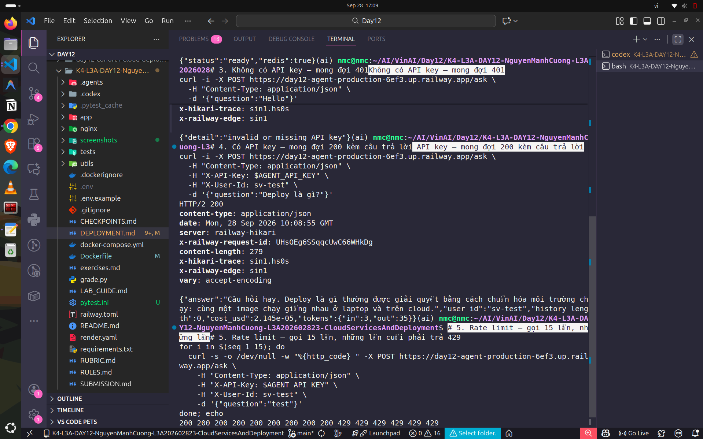

# Thông Tin Deploy — Checkpoint 5

> **Chỉ ghi TÊN biến môi trường, tuyệt đối không dán giá trị API key vào đây.**
> Repo này công khai — dán khóa vào là mất khóa.

## Thông Tin Học Viên

| Mục | Nội dung |
|-----|----------|
| Họ và tên | Nguyễn Mạnh Cường |
| Mã học viên | 2A202602823 |
| Repo | https://github.com/nmc2004nd/K4-L3A-DAY12-NguyenManhCuong-L3A202602823-CloudServicesAndDeployment.git |

## Service

| Mục | Nội dung |
|-----|----------|
| Public URL | https://day12-agent-production-6ef3.up.railway.app |
| Platform | Railway |
| Ngày deploy | 28/09/2026 |

## Biến Môi Trường Đã Set Trên Cloud

Ghi tên biến và **nguồn giá trị**, không ghi giá trị:

| Biến | Đã set | Ghi chú |
|------|--------|---------|
| `PORT` | ✅ | platform tự gán |
| `AGENT_API_KEY` | ✅ | đặt trong dashboard, không nằm trong repo |
| `REDIS_URL` | ✅ | tham chiếu private URL của Railway Redis service |
| `RATE_LIMIT_PER_MINUTE` | ✅ | 10 |
| `MONTHLY_BUDGET_USD` | ✅ | 10.0 |
| `LOG_LEVEL` | ✅ | INFO |

## Lệnh Kiểm Tra

```bash
# Nạp API key từ .env vào shell hiện tại mà không in giá trị secret.
set -a
source .env
set +a

# 1. Liveness — mong đợi 200 {"status":"ok"}
curl -i https://day12-agent-production-6ef3.up.railway.app/health

# 2. Readiness — mong đợi 200 {"status":"ready"} (đã nối được Redis)
curl -i https://day12-agent-production-6ef3.up.railway.app/ready

# 3. Không có API key — mong đợi 401
curl -i -X POST https://day12-agent-production-6ef3.up.railway.app/ask \
  -H "Content-Type: application/json" \
  -d '{"question":"Hello"}'

# 4. Có API key — mong đợi 200 kèm câu trả lời
curl -i -X POST https://day12-agent-production-6ef3.up.railway.app/ask \
  -H "Content-Type: application/json" \
  -H "X-API-Key: $AGENT_API_KEY" \
  -H "X-User-Id: sv-test" \
  -d '{"question":"Deploy là gì?"}'

# 5. Rate limit — gọi 15 lần, những lần cuối phải trả 429
for i in $(seq 1 15); do
  curl -s -o /dev/null -w "%{http_code} " -X POST https://day12-agent-production-6ef3.up.railway.app/ask \
    -H "Content-Type: application/json" \
    -H "X-API-Key: $AGENT_API_KEY" \
    -H "X-User-Id: sv-test" \
    -d '{"question":"test"}'
done; echo
```

## Kết Quả Chạy Thật

```text
GET /health  -> HTTP/2 200
{"status":"ok","service":"day12-agent","version":"1.0.0"}

GET /ready   -> HTTP/2 200
{"status":"ready","redis":true}

POST /ask (không có API key) -> HTTP/2 401
{"detail":"invalid or missing API key"}

POST /ask (API key hợp lệ) -> HTTP/2 200
{"answer":"Câu hỏi hay. Deploy là gì thường được giải quyết bằng cách chuẩn hóa môi trường chạy: cùng một image chạy giống nhau ở laptop và trên cloud.","user_id":"cp5-auth-proof","history_length":0,"cost_usd":2.145e-05,"tokens":{"in":3,"out":35}}

Rate limit (12 request, user mới):
200 200 200 200 200 200 200 200 200 200 429 429
```

## Ảnh Chụp Màn Hình

| Ảnh | Minh chứng |
|-----|------------|
| [`screenshots/dashboard.png`](screenshots/dashboard.png) | Railway dashboard: service `day12-agent` và Redis đều Online |
| [`screenshots/health.png`](screenshots/health.png) | Endpoint `/health` chạy qua HTTPS công khai và trả `status: ok` |
| [`screenshots/test_1.png`](screenshots/test_1.png) | `/health` và `/ready` trả 200; `/ask` không có API key trả 401 |
| [`screenshots/test_2.png`](screenshots/test_2.png) | `/ask` có API key trả 200; rate limit trả 429 sau 10 request |

### Railway Dashboard



### Public Health Endpoint



### Kết Quả Kiểm Tra API




